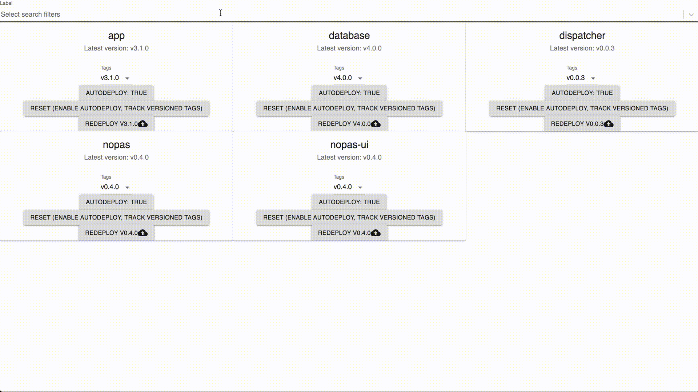

# Registrywatcher



Watches docker registries for new tags on selected repositories.

The service maintains an internal state stored in Postgres for each watched repository for `pinned_tag` and `auto_deploy`

`pinned_tag"` is set to an empty string by default. `pinned_tag=""` has a special meaning within this service. It enables the auto-deployment feature for versioned tags, (i.e. a new tag `v1.0.0` will be autodeployed if the current deployed tag is `v0.9.0`)

`pinned_tag` can also be set to a custom tag through the `/tags/$REPO_NAME` endpoint. Auto deployment for custom tags happen if the docker content digest of of the tag changes (i.e. the tagged docker image was overwritten).

`auto_deploy` determines whether auto deployment is enabled for both custom tags and versiomed tags.

Currently only Nomad is supported as the deployment client.

## Configuration

Before running the service locally or in production, the config file `config/staging.toml` must be present. A template is provided in config/sample.toml with sensible defaults. Most should be left alone unless you're developing `registrywatcher` itself. However, there are a few you may want to change in a production environment.
A sample config file template has been provided in `config/sample.toml`

## Endpoints

```yml
- url: /ping/
  method: GET

  Response:
  - message: string

  description: Returns "pong", for health check.
```

```yml
- url: /tags/$REPO_NAME/reset
  method: POST

  JSON Body Request:
  - N/A

  Response:
  - message: string

  description: To reset the pinned_tag to latest, which is the default value. See top of the README for more info.
```

```yml
- url: /tags/$REPO_NAME
  method: POST

  JSON Body Request: (at least 1 argument provided)
  - pinned_tag: string (no default)
  - auto_deploy: bool (no default)

  Response:
  - message: string

  description: To update the pinned_tag for the given repo_name and deploy it regardless of current deployed tag.
```

```yml
- url: /tags/$REPO_NAME
  method: GET

  200 Response:
  - repo_tag: string

  400 Response:
  - message: string

  description: To get the pinned_tag value for the given $REPO_NAME.
```

```yml
- url: /repos
  method: GET

  200 Response:
  - $REPO1_NAME(string):
    - "auto_deploy": bool
    - "pinned_tag": string
    - "pinned_tag_value": string
    - "tags": [string, ...]
  ...

  description: To get the pinned_tag value for all watched repositories.
```

## Local development

`docker-compose up -d`

## Deployment

Config files are located in `$PROJ_ROOT/config`. It's best for the config file to be interpolated with the necessary values during deployment, i.e. repositories to be watched, nomad token. A sample config file is provided anyway for running locally (with sensitive information left to be filled in by the user)

The following environment variables must be present for deployment:
- `DATABASE_URL` to connect to the postgres db (if not present `database_url` in config file will be used)
- `NOMAD_TOKEN` to access the nomad API

The following environment variables are optional:
- `VAULT_TOKEN` to run the nomad job associated with a watched repo, if the nomad job has Vault secrets.

The configuration file must be interpolated by Nomad to fill the following information:
- `registry_auth ` for each of the supported registries
- `watched_repositories` lists all the repositories to watch for
- key value pairs in `repo_map`, which maps the docker registry and nomad job name of each watched repositories

## Test setup

Ports 5000 and 5432 need to be free as they are currently hardcoded for the registry and postgres container respectively.
https://stackoverflow.com/questions/48593016/postgresql-docker-role-does-not-exist

You need to make one modification to your docker daemon config (usually at ~/.docker/daemon.json)

Add the flag `--insecure-registry localhost:5000` to your docker daemon, documented [here](https://docs.docker.com/registry/insecure/) for testing against an insecure registry.

You may need to update the certificates from time to time. To do so, run

```bash
make snakeoil
```

## Tests

Run locally:

```bash
// run both integration and unit tests
gotestsum -- -tags="integration unit" ./...
```

The tests don't test the nomad deployment capability of the service.

## TODO

A makefile to avoid having to change your local docker daemon config so as to run the tests as docker-in-docker for CI integration.

A makefile step to regenerate testing certificates in `testutils/snakeoil`

An interface to swap in the deployment agent (only Nomad supported for now).

Tests take too long to run, this is mainly due each integration test case spinning up and down its own docker containers.

Nomad mock server cannot run jobs, which blocks writing of integration tests involving Nomad API calls

Buttons should implement debouncing

Bug where only new tags/SHA changes AFTER you toggle back auto deployment will trigger an update, meaning any updates during the window where auto deployment was turned off are moot.
